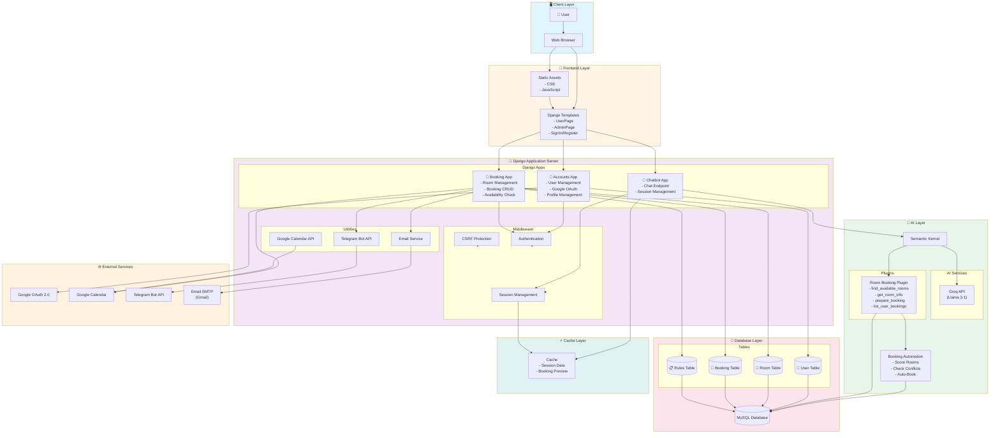
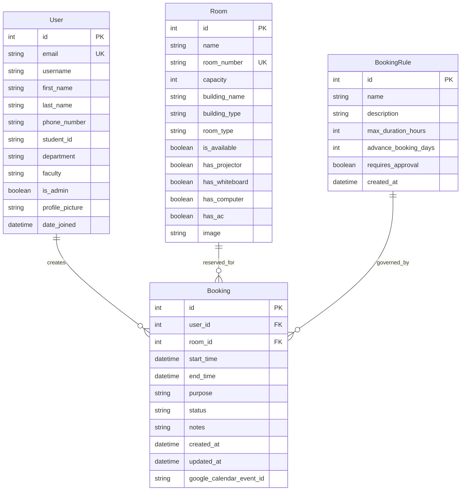
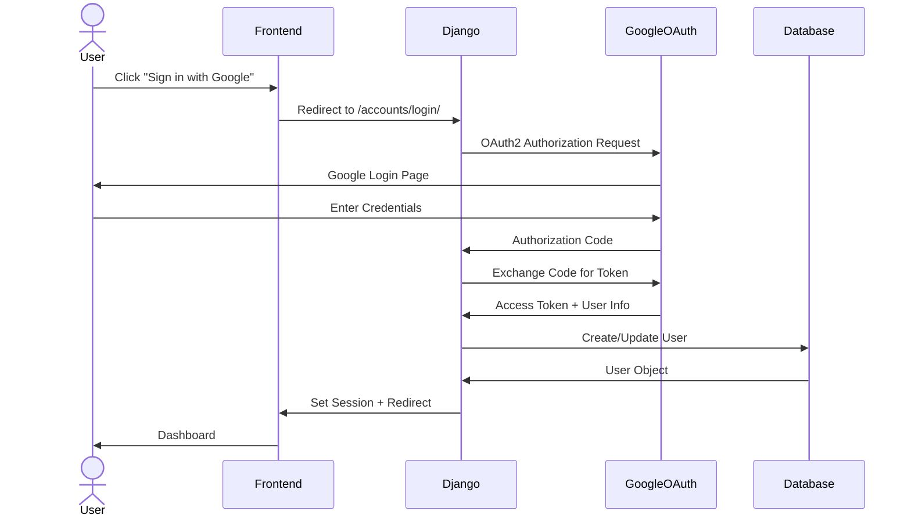
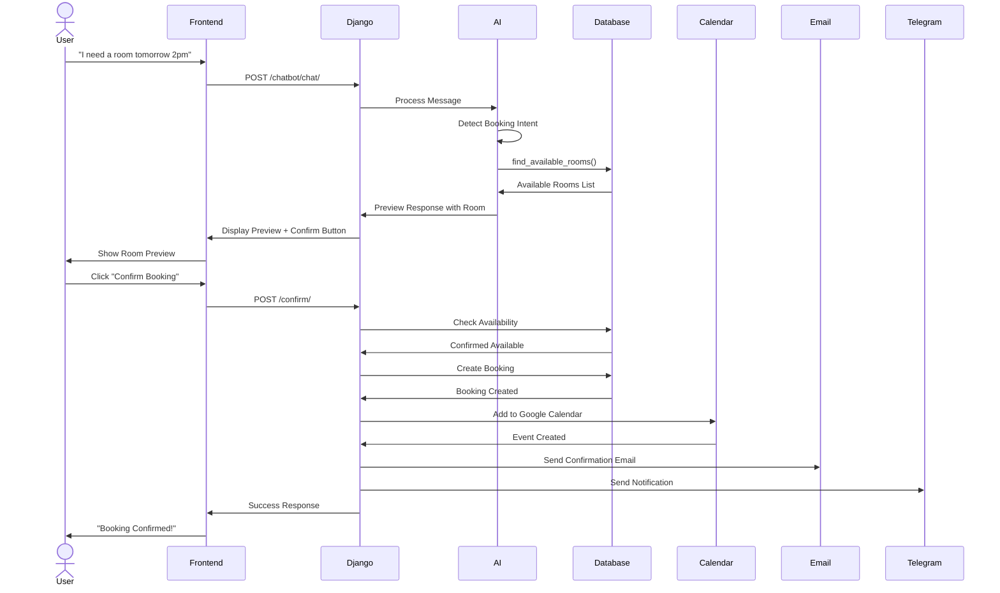
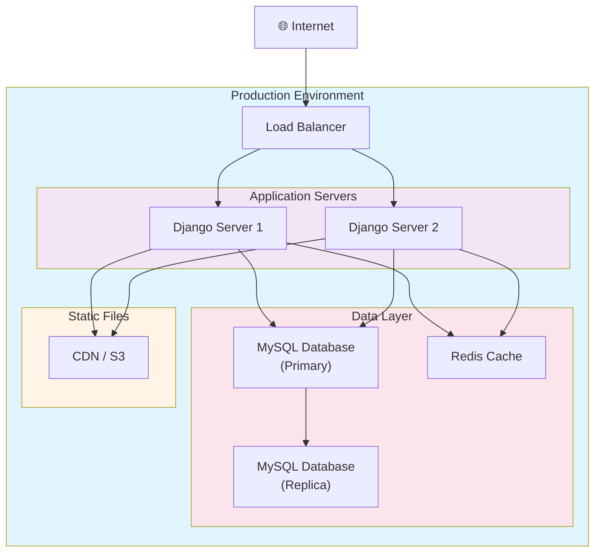

# Room Booking System - System Architecture

## 📐 Complete System Architecture



## 🔄 AI Chatbot Flow (Detailed)

```mermaid
flowchart LR
    User["👤 User Input"] --> Frontend["🌐 Frontend"]
    
    subgraph Server["Django Server"]
        Frontend --> ChatView["📥 /chatbot/chat/<br/>POST Endpoint"]
        
        subgraph ChatFlow["Chat Processing"]
            ChatView --> Agent["🤖 Chat Agent"]
            Agent --> Detect["🔍 Detect Intent<br/>(General vs Booking)"]
            
            Detect -->|"General Query"| DirectAI["🗣️ Direct AI Response<br/>(No Tools)"]
            Detect -->|"Booking Query"| ToolAI["🛠️ AI with Tools<br/>(Function Calling)"]
            
            ToolAI --> Groq["🧠 Groq API Call<br/>with Tools"]
            Groq --> CheckFunc{"Function<br/>Called?"}
            
            CheckFunc -->|"Yes"| ExecFunc["⚙️ Execute Plugin<br/>Function"]
            ExecFunc --> QueryDB["💾 Query Database"]
            QueryDB --> FuncResult["📊 Function Result"]
            FuncResult --> FinalAI["🗣️ AI Final Response<br/>(with DB data)"]
            
            CheckFunc -->|"No"| DirectResp["💬 Direct Response"]
            
            DirectAI --> Response["📤 JSON Response"]
            FinalAI --> Response
            DirectResp --> Response
        end
        
        Response --> Cache["⚡ Cache Result"]
        Cache --> Preview["👁️ Preview/Confirm"]
    end
    
    Preview --> Frontend
    Frontend --> User
    
    User -->|"Confirm"| ConfirmEndpoint["✅ /confirm<br/>POST Endpoint"]
    ConfirmEndpoint --> AuthUser["🔐 Resolve User"]
    AuthUser --> AutoBook["🎯 Auto Book"]
    AutoBook --> DB["💾 Save to DB"]
    DB --> Notify["📧 Send Notifications"]
    Notify --> Result["✅ Booking Complete"]
    Result --> User
    
    style Server fill:#f3e5f5
    style ChatFlow fill:#e8f5e9
```



## 📊 Database Schema



## 🔐 Authentication Flow



## 📥 Booking Creation Flow



## 🏗️ Technology Stack

### Backend
- **Framework**: Django 4.x
- **Language**: Python 3.13
- **Database**: MySQL
- **Cache**: Django Cache Framework
- **Async**: ASGI with async views

### AI/ML
- **AI Framework**: Semantic Kernel
- **LLM Provider**: Groq
- **Model**: Llama 3.1 8B Instant
- **Capabilities**: Function calling, natural language processing

### Frontend
- **Templates**: Django Templates
- **CSS**: Custom CSS + Bootstrap
- **JavaScript**: Vanilla JS + jQuery
- **Icons**: Font Awesome

### External APIs
- **Authentication**: Google OAuth 2.0
- **Calendar**: Google Calendar API
- **Notifications**: Telegram Bot API
- **Email**: SMTP (Gmail)

### DevOps
- **Deployment**: PythonAnywhere / Render
- **Container**: Docker (optional)
- **Version Control**: Git

## 📁 Project Structure

```
RoomBooking/
├── accounts/              # User management app
│   ├── models.py         # User model
│   ├── views.py          # Auth views
│   ├── forms.py          # User forms
│   └── adapters.py       # OAuth adapters
│
├── booking/              # Room booking app
│   ├── models.py         # Room, Booking, BookingRule
│   ├── views.py          # Booking CRUD
│   ├── api_views.py      # REST API
│   ├── admin_views.py    # Admin dashboard
│   ├── google_calendar.py # Calendar integration
│   ├── email_utils.py    # Email service
│   └── telegram_notifications.py
│
├── chatbot/              # AI chatbot app
│   ├── views.py          # Chat endpoint
│   └── apps.py           # Chat agent initialization
│
├── ai/                   # AI components
│   ├── kernel_config.py  # Semantic Kernel setup
│   ├── booking_automation.py # Booking logic
│   └── plugins/
│       └── room_booking_plugin.py # SK plugin
│
├── templates/            # HTML templates
│   ├── UserPage/
│   ├── AdminPage/
│   └── SignIn-RegisterPage/
│
├── static/               # Static assets
│   ├── css/
│   ├── js/
│   └── images/
│
└── room_booking_system/  # Main project
    ├── settings.py       # Django settings
    ├── urls.py           # URL routing
    └── wsgi.py           # WSGI config
```

## 🔒 Security Features

1. **Authentication**
   - Google OAuth 2.0 integration
   - Session-based authentication
   - CSRF protection

2. **Authorization**
   - Role-based access control (User/Admin)
   - Booking ownership validation
   - Admin-only endpoints

3. **Data Protection**
   - SQL injection prevention (Django ORM)
   - XSS protection (Django templates)
   - Secure password handling

4. **API Security**
   - CORS configuration
   - Rate limiting (via Groq)
   - Input validation

## 🚀 Deployment Architecture



## 📈 Scalability Considerations

1. **Horizontal Scaling**: Multiple Django servers behind load balancer
2. **Database Replication**: Master-slave MySQL setup
3. **Caching**: Redis for session and query caching
4. **CDN**: Static assets served via CDN
5. **Async Processing**: Background tasks for emails/notifications
6. **API Rate Limiting**: Prevent abuse of AI chatbot

## 🔧 Key Features

✅ **User Management**
- Google OAuth integration
- Profile management
- Department/Faculty organization

✅ **Room Booking**
- Real-time availability checking
- Conflict prevention
- Booking rules enforcement
- Google Calendar sync

✅ **AI Chatbot**
- Natural language booking
- Database query integration
- Function calling for room search
- Conversational interface

✅ **Admin Dashboard**
- Room management
- Booking oversight
- User management
- Analytics

✅ **Notifications**
- Email confirmations
- Telegram alerts
- Calendar invites

✅ **API**
- RESTful endpoints
- JSON responses
- CORS support

---

**Version**: 2.0  
**Last Updated**: January 17, 2026  
**Architecture Type**: Monolithic with Microservice AI Layer
